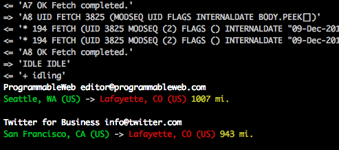

# MailHops IMAP listener
[www.MailHops.com](https://www.mailhops.com)


This app will loop through all the mail in an IMAP account and geo route all messages.  You can use the live feed on your mailhops.com account to monitor your incoming messages.  Leave it running and it will route incoming messages.

You can also add a [custom Slack integration](https://mailhops.slack.com/apps/build/custom-integration) to post messages to Slack.  Use the subjectFilter or fromAddress in [the config](config.sample) to limit the messages posted to Slack.

```sh
# install npm modules
npm install

# Add you email connection info in config.json
cp config.sample config.json

# set searchFilter to UNSEEN to only monitor new incoming messages
vim config.json

# start the app
npm start
```


